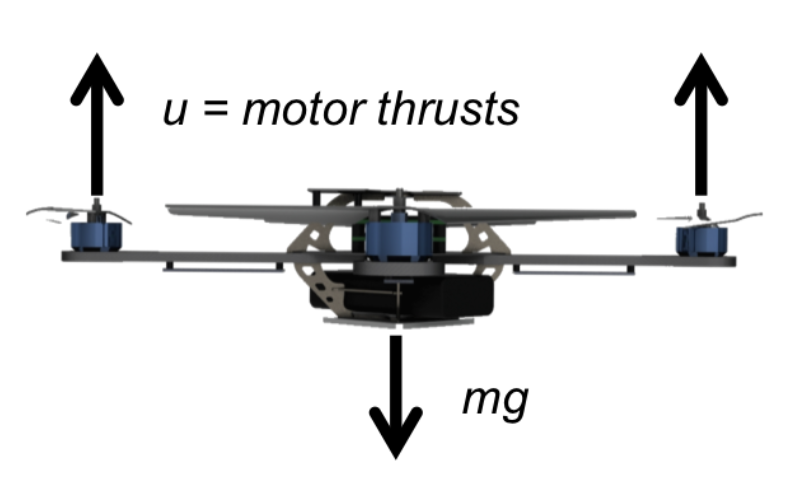
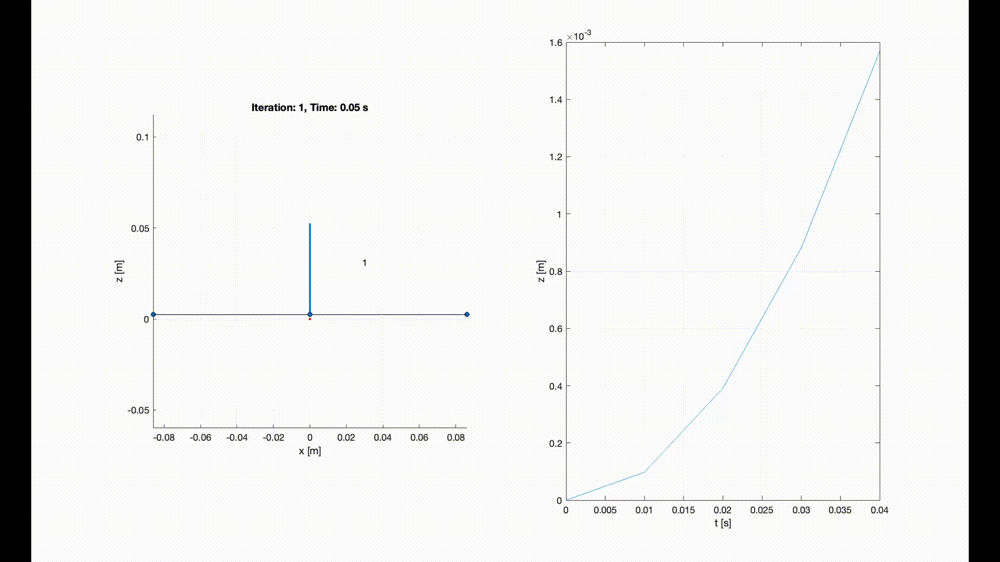

# PD Controller For 1D Quadrotor
This project is about implementing a Proportional-Derivative (PD) control system for a one-dimensional (1D) quadrotor. The objective is to stabilize the quadrotor's position along a single axis while ensuring smooth motion. The PD controller computes corrective actions based on desired acceleration, its position error (difference between desired and current positions) and its velocity error (difference between desired and current velocities), allowing for precise control.

## Table of Contents
- [Introduction](#introduction)
   - [Technical Details](#technical-details)
   - [PD Controller](#pd-controller)
- [Features](#features)
- [Requirements](#requirements)
- [Usage](#usage)
- [File Structure](#file-structure)
- [Results](#results)
- [Future Work](#future-work)
- [License](#license)
- [Acknowledgments](#acknowledgments)
- [References](#references)

## Introduction  
The goal of this project is to get familiar with working with a quadrotor simulator and implementing a Proportional-Derivative (PD) controller. The PD controller is designed to manage the vertical motion of the quadrotor by adjusting thrust to achieve stability and respond to specific height requirements.  

### Technical Details  

The physical properties of the quadrotor are:
- Mass ($m$) : 0.18($kg$)
- Lenght of arm ($l$) : 0.086($m$)



The dynamic equation governing the motion of the quadrotor in the vertical ($z$) direction is given by:  

$$
\ddot{z} = \frac{u}{m} - g
$$  

Where:  
- $\ddot{z}$: Acceleration in the $z$-direction. $(m/s^2)$  
- $u$: Control input (thrust force). $(N)$  
- $m$: Mass of the quadrotor. $(kg)$
- $g$: Gravitational acceleration. $(m/s^2)$
- $u_{min}$ is 0 $(N)$
- $u_{max}$ is $1.2mg$ $(N)$  

### PD Controller  
The control input $u$ for the Proportional-Derivative (PD) controller is defined as:  

$$
u = m(\ddot{z}_{\text{des}} + K_p e + K_v \dot{e} + g)
$$  

Where:  
- $\ddot{z}_{\text{des}}$: Desired acceleration in the $$z$$-direction. $(m/s^2)$
- $K_p$: Proportional gain.  
- $K_v$: Derivative gain.  
- $e = z_{\text{des}} - z$: Position error (difference between desired and current height).  
- $\dot{e} = \dot{z}_{\text{des}} - \dot{z}$: Velocity error. 

In this project, I have implemented a custom PD controller to control the height of a 1D quadrotor and tuned its gains $K_p$ and $K_v$ for optimal performance. The controller is tested with two distinct cases:  

1. **Stabilization at Zero Height**:  
   The quadrotor needs to maintain stability at a height of 0 meters.  

2. **Step Input Test**:  
   The quadrotor is given a step input to rise to a height of 1 meter and maintain this position. 

## Features  
- **PD Controller Implementation**:  
  Implements a custom Proportional-Derivative (PD) controller to manage the quadrotor's vertical position.  

- **Simulation Environment**:  
  Provides a realistic simulation of the quadrotor's dynamics under the control of the PD system.  

- **Graphical User Interface (GUI)**:  
  Includes an interactive GUI for:
  - Simulating the quadrotor's motion.
  - Visualizing the controller's response over time.

## Requirements
- MATLAB (preferably R2018b or later)

## Usage
Clone this repository and run the `simulation.m` file
```matlab
params - A structure containing the following fields:
   params.gravity    - Gravitational constant (m/s^2)
   params.mass       - Mass of the quadrotor (kg)
   params.arm_length - Length of the quadrotor arm (m)
   params.u_min      - Minimum control input (thrust)
   params.u_max      - Maximum control input (thrust)
```

## **File Structure**  
The project consists of the following MATLAB functions:

- **`simulation.m`**:  
   The main function that initiates the simulation. It connects the desired trajectory, PD controller, and dynamics, and visualizes the quadrotor's height control performance.

- **`fixed_set_point.m`**:  
   Generates the desired state trajectory for the system. For all times $t > 0$, the desired state remains constant at $[z_{\text{des}}; 0]$, where $z_{\text{des}}$ is the desired position along the $z$-axis.

- **`controller.m`**:  
   Implements a Proportional-Derivative (PD) controller to regulate the height of the quadrotor. The controller computes the thrust required based on position and velocity errors.

- **`height_control.m`**:  
   Simulates the closed-loop height control system of the quadrotor. It applies control inputs, integrates the system's equations of motion, and updates the state over time.

- **`libs/`**:  
   Contains helper functions for the simulation:  
   - **`QuadPlot.m`**:  
     Visualizes the quadrotor's position and trajectory over time, including motor positions and historical movement.  
   - **`QuatToRot.m`**:  
     Converts a unit quaternion into its corresponding $3 \times 3$ rotation matrix. Useful for orientation computations.  
   - **`quad_pos.m`**:  
     Calculates the quadrotor's position in the world frame based on its state.  
   - **`simStateToQuadState.m`**:  
     Converts simulation state data into the 13-element state vector format:  
     $[x, y, z, \dot{x}, \dot{y}, \dot{z}, q_w, q_x, q_y, q_z, p, q, r]$.  
   - **`sys_eom.m`**:  
     Defines the equations of motion (EOM) for the quadrotor system. For 1D motion, it simplifies to:  
     $\ddot{z} = \frac{u}{m} - g$  
     where $u$ is the thrust generated by the controller.  
   - **`sys_params.m`**:  
     Sets system parameters, such as the quadrotor's mass $m$, gravitational acceleration $g$, arm lenght $l$, minimum thrust input $u_{min}$ and maximum thrust input $u_{max}$.

## Results

### Quadrotor Simulation for z = 1m t = 5s


## Future Work  

The current implementation effectively stabilizes the 1D quadrotor and performs basic position control. However, there are several areas where the system can be enhanced while remaining within the 1D motion framework. These improvements aim to refine control precision, robustness, and adaptability under realistic conditions:  

### 1. **Adaptive Gain Tuning**  
   The fixed proportional ($K_p$) and derivative ($K_v$) gains may not be optimal under varying conditions. Adaptive gain tuning can dynamically adjust these parameters to:  
   - Enhance performance under changing conditions, such as varying payloads or external disturbances.  
   - Reduce overshoot and oscillations for different types of trajectories.  
   Real-time optimization techniques, such as Recursive Least Squares (RLS) or model-based adaptive control, can be employed to achieve this.  

### 2. **Robustness Against Disturbances and Noise**  
   Real-world scenarios often introduce uncertainties, such as external disturbances or sensor noise. To make the system more robust:  
   - **Disturbance Rejection**: Design disturbance observers or use feedforward compensation to counteract known disturbances, such as wind or persistent forces.  
   - **Sensor Noise Handling**: Implement low-pass or Kalman filters to reduce the impact of noise on velocity and position measurements. This is especially important when estimating derivatives, as noise can amplify errors.  

### 3. **Integral Control for Eliminating Steady-State Errors**  
   While the PD controller ensures good transient response, it can leave steady-state errors in scenarios with persistent disturbances (e.g., unmodeled drag). Incorporating an integral term to create a PID controller would:  
   - Accumulate errors over time and adjust control inputs to achieve zero steady-state error.  
   - Improve accuracy when the system operates near its thrust limits.  

### 4. **Trajectory Optimization for Smooth Motion**  
   The current system is tested primarily with step inputs or fixed setpoints. Extending the system to handle optimized trajectories could improve performance by:  
   - Designing time-optimal or smooth trajectories (e.g., splines or polynomials) for transitions between positions.  
   - Ensuring control actions respect the thrust constraints $(u_{\text{min}}$ and $u_{\text{max}}\$ while minimizing oscillations and abrupt accelerations.  
   - Balancing response time and precision for practical applications, such as delivery systems or height-following tasks.  

### 5. **Nonlinear Control Strategies**  
   Although the current PD controller works well for linear approximations, the quadrotor dynamics are inherently nonlinear. Nonlinear control methods can provide enhanced performance:  
   - **Feedback Linearization**: Simplify nonlinear dynamics for controller design while ensuring better control fidelity.  
   - **Sliding Mode Control**: Enhance robustness under parameter uncertainties and disturbances.  
   - **Lyapunov-Based Control**: Offer formal stability guarantees while addressing the nonlinear nature of the quadrotor's dynamics.  

### 6. **Model Refinement and Parameter Adaptation**  
   The current model assumes ideal conditions with constant parameters. Enhancing the model can improve control performance:  
   - **Incorporate Additional Dynamics**: Account for unmodeled effects like drag forces or actuator response time.  
   - **Parameter Estimation**: Implement online parameter estimation algorithms to detect and adapt to changes in mass (e.g., varying payloads) or thrust coefficients.  

### 7. **Evaluation in Realistic Scenarios**  
   The system can be further validated by simulating or implementing more realistic conditions:  
   - **Random Disturbances**: Introduce stochastic disturbances, such as fluctuating wind forces, to test robustness.  
   - **Sensor Noise and Latency**: Simulate sensor inaccuracies and delays to evaluate the impact on control performance.  
   - **Extreme Conditions**: Test the system under challenging initial conditions (e.g., large deviations from equilibrium) to evaluate stability margins.  

### 8. **Learning-Based Control Enhancements**  
   Machine learning techniques can further optimize the control system:  
   - **Reinforcement Learning**: Use simulation to train an agent to derive optimal control policies that account for nonlinearities and disturbances.  
   - **Neural Networks**: Approximate the nonlinear dynamics and improve the controller’s ability to respond to complex conditions.  
   - **Supervised Learning**: Use historical data to fine-tune gains or predict required thrust for specific scenarios.  

By focusing on these areas, the 1D quadrotor control system can become more adaptable, precise, and robust for real-world applications without the need to expand into higher dimensions.

## License
This project is licensed under the MIT License. See the LICENSE file for details.

## Acknowledgments

Inspired by the course Aerial Robotics offered by the University of Pennsylvania on Coursera.

## References
- MATLAB Documentation:
   - [ODE45](https://www.mathworks.com/help/matlab/ref/ode45.html)
   - [Graphics](https://www.mathworks.com/help/matlab/graphics.html)
   - [OpenGL](https://www.mathworks.com/help/matlab/ref/opengl.html)
- Coursera Course [Aerial Robotics by University of Pennsylvania](https://www.coursera.org/learn/robotics-flight)
- Control Theory Concepts: K. Ogata, Modern Control Engineering, Prentice Hall
